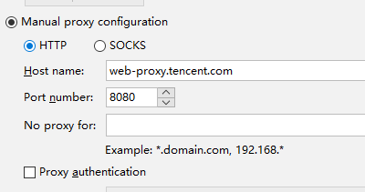
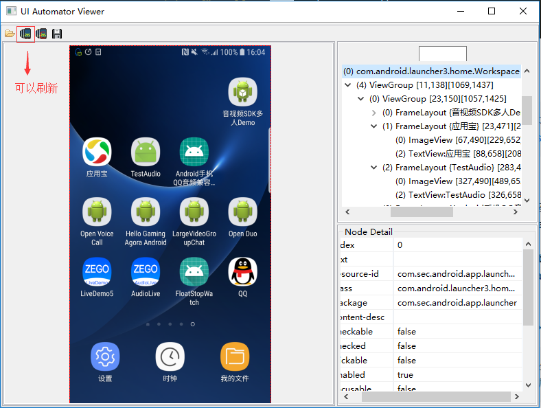

# Android Python UiAutomator

@(开发)[自动化]

## 环境准备
### 安装uiautomator库
https://github.com/xiaocong/uiautomator
``` bash
pip install uiautomator
```
### 安装adb工具
http://adbshell.com/downloads
配置环境变量
验证安装是否成功（手机需要再“开发者模式”下开启USB调试）
``` bash
adb shell
```
### 验证python 控制能力
>可以通过 adb logcat ActivityManager:1 *:s  命令来查看需要启动的App的package名和Activity名称

验证python控制 -> 打开电话拨号码114
``` python
import os

command = "adb shell am start -a android.intent.action.CALL -d tel:114"
print os.system(command)
```
###安装 Android SDK
https://developer.android.com/studio/
公司内代理设置



### 设置 Android_Home环境变量
1. 新建环境变量 ANDROID_HOME， 指向 Android SDK的目录， 如 C:\Users\aragornzhao\AppData\Local\Android\Sdk
2. 在Path中加入 %ANDROID_HOME%\tools, 保存
3. 在命令行输入 android list target , 验证是否设置成功

### 手机设置，允许从未知来源安装应用
系统设置->系统安全->允许从未知来源安装应用

### 安装uiautomator 引用
使用应用宝或工具来安装  \Python27\Lib\site-packages\uiautomator\libs 下的 app-uiautomator.apk 与 app-uiautomator-test.apk

### 验证是否生效
``` python
from uiautomator import device as d
d.screen.on()
d(text="时钟").click()
```

### JDK 安装及环境变量设置
>为了和Android SDK的兼容性，JDK选取的版本为JDK 8
https://www.oracle.com/technetwork/java/javase/downloads/jdk8-downloads-2133151.html

安装完成后，需要设置环境变量
1. 添加环境变量 JAVA_HOME, 变量值设为JDK安装目录，如 D:\Program Files\Java\jdk1.8.0_191
2. 在PATH变量中加入 **%Java_Home%\bin;%Java_Home%\jre\bin;**
3. 添加环境变量 CLASSPATH,  变量值设为 **.;%Java_Home%\bin;%Java_Home%\lib\dt.jar;%Java_Home%\lib\tools.jar**
4. 验证是否设置成功，在cmd控制台输入java, javac，java -version，观察返回

### UIAutomatorViewer工具可以使用
>可以利用Andorid自带的这个工具查看手机应用坐标，属性等信息
sdk/tools/bin/uiautomatorviewer(Windows下加后缀.bat)



对于一些动态页面，可以采用如下方式来提取元素信息
1） adb shell /system/bin/uiautomator dump /data/local/tmp/uidump.xml
2）uiautomator dump
``` python
from uiautomator import device as d
d.dump(r'hierarchy.xml')
```

### 参考材料
https://blog.csdn.net/jgw2008/article/details/78286469
https://github.com/xiaocong/uiautomator
https://www.cnblogs.com/cnwutianhao/p/5487758.html

